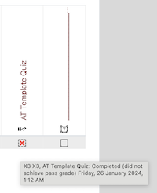

# moodle-availibility_completionstatus
Adds the condition completion status to restrice access in moodle courses. 
This plugin is based on Moodle core's condition completion but interprets the completion status in a different way. An activity is considered completed when the activity is reported completed in Reports for Activity completion. 

# reason for the necessity
With MDL-79367 logic of availability condition completion has changed. 
"MDL-79367 availability: Fail grade does not mark activities as completed
The UX team confirmed that an activity shouldn't be considered completed when the criteria use a passing grade and the user gets a failing grade.
So the COMPLETION_COMPLETE_FAIL status won't be considered completed from now on."

There is no simple option for restricting access by condition "activity completed (either passed or failed).

